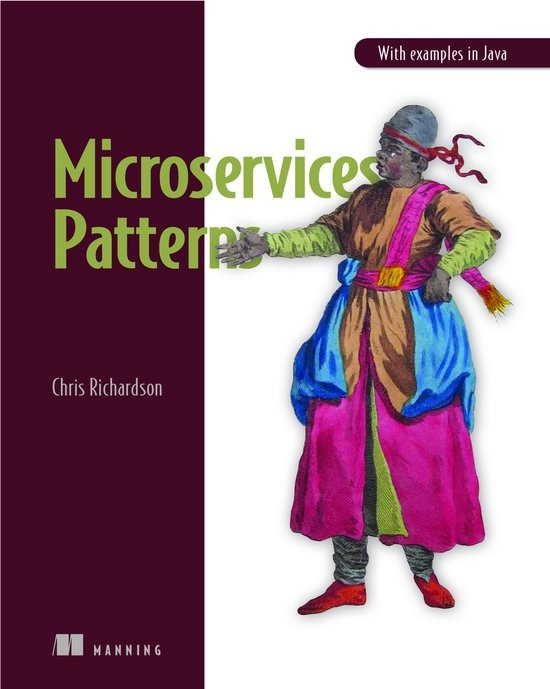
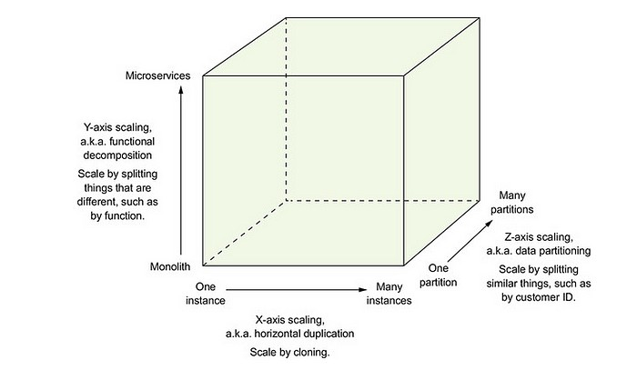
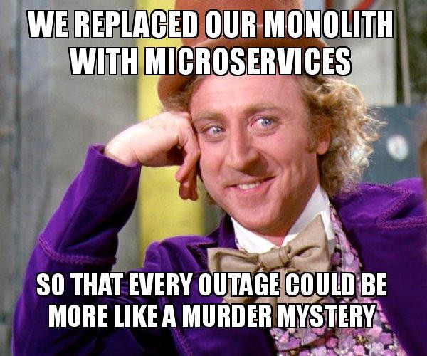
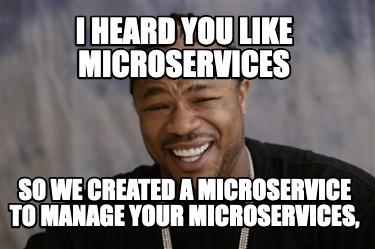
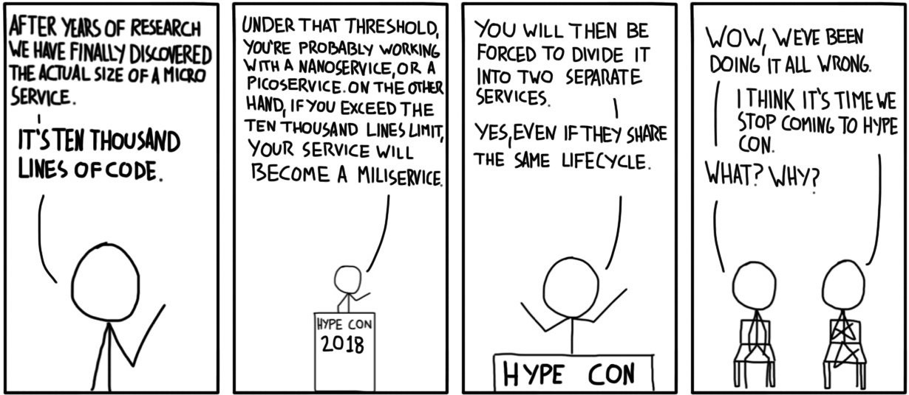
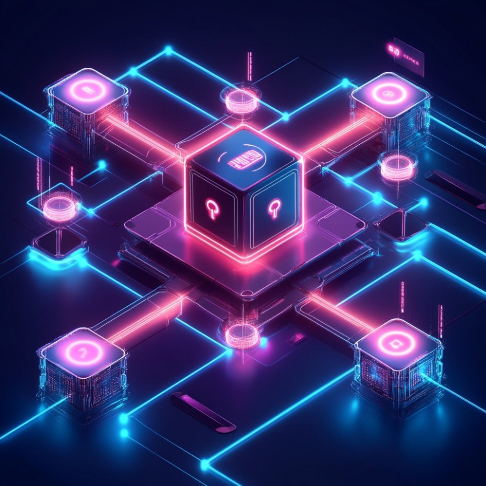
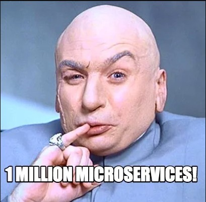
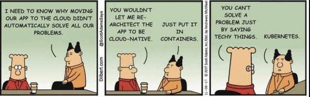

# Micro
# Services

::image::

---
layout: agenda
textSize: sm
items:
  - The Monolith
  - MicroServices
  - Interprocess Communication
  - Business Logic
  - Queries
  - External APIs
  - Production Ready
  - Deployment
---
---
layout: default-aside
disabled: true
---

# Chapters

<v-clicks>

- The Monolith
- Interprocess Communication
- Transactions
- Business Logic
- Queries
- External APIs
- Testing
- Deployment
- Decomposition & Refactoring

</v-clicks>

::image::

---
layout: two-col-image-text
---

# Microservices Patterns

## Tis een halve boekbespreking

::image::

::content::

<v-clicks depth="2">

- With examples in Java
- 470 pages on everything MicroServices
- By Chris Richardson: microservices.io
- Describes a collection of Patterns

</v-clicks>
---
layout: default-aside
---

# Microservices Patterns

## Design Patterns... Again?

<v-clicks depth="2">

- FORCES
  - What we must address
- RESULTING CONTEXT
  - Benefits -- what did we gain
  - Drawbacks -- what did we lose
  - Issues -- new problems we introduced
- FOR
  - Application And Infrastructure

</v-clicks>

::image::

---
layout: statement
---

You probably shouldn't do this

::author::

Most teams would be better off with a well-built monolith.

This talk is for the teams that have decided otherwise.

---
layout: section
---

# The Monolith

::subtitle::

Monolithic Architecture

---
layout: default-aside
---

# Monolithic Architecture

<v-clicks depth="2">

- For example n-tier or Hexagonal
- Why you should build a Monolith
  - It's easy -- your IDE handles it well
  - It's easy -- everyone has experience creating one
  - It's easy -- to write unit & integration tests
  - It's easy -- to deploy
  - It's easy -- to scale (typically)
  - It's easy -- to make big changes

</v-clicks>

Typically a good top level architecture to start with

::image::

---
layout: default-aside
disabled: true
---

# 4+1 View Model

- Implementation View:
  - Monolith: a single exe
  - MicroServices: multiple exes
- Logical View:
  - Both are layered or hexagonal

::image::

---
layout: statement
---

If your application is very successful, the monolith may turn out to be not such a great idea after all

::image::

<!--
The team grew, the codebase grew, the product grew
-->
---
layout: two-col-image-text
---

# Monolithic Hell

::image::

::content::

<v-clicks>

- The codebase intimidates developers
- Development is slow
  - Edit-build-run-test loop takes a long time
- The road to deploy is long and arduous
- Locked in an increasingly obsolete stack

</v-clicks>
---
layout: two-col-image-text
---

# The Scale Cube

## Scaling may turn out to be not that easy (anymore)

::image::

---
layout: statement
---

Maintainability, extensibility and testability suffer

::image::

<!--
A 2-day feature becomes a 2-week feature.  
Adding a new dev takes 6 months to ramp up.  
The test suite takes 45 minutes — so nobody runs it locally.
-->

---
layout: section
---

# MicroServices

::subtitle::

So... MicroServices?

---
layout: default-aside
textSize: xl
---

# So... MicroServices?

<v-clicks>

- Each service is small and easily maintained
- Can be independently deployed
- Can be independently scaled
- Better fault isolation
- Easy experimentation and adoption of new technologies
- Teams can work autonomously

</v-clicks>

::image::

<!--
Each service can be X & Z scaled.

**Teams can work autonomously**: is what actually matters, and what nobody plans for.
-->

---
layout: statement
---

Organizations which design systems … are constrained to produce designs which are copies of the communication structures of these organizations

::author::

**Melvin Conway**

<!--
Conway's Law. 1968.

What it means in plain English: if you have four teams writing a compiler, you will get a four-pass compiler. The shape of the software ends up matching the shape of the org chart, every single time, because that's where the communication boundaries are.

For microservices this cuts both ways. If your team structure is "frontend team, backend team, DBA team", you will get a three-tier monolith no matter how hard you try to draw service boundaries on a whiteboard. The architecture will revert to match the org chart within six months.

The flip side is the useful one: if you WANT a particular service architecture, change the teams first. That's the **Inverse Conway Maneuver** — restructure your teams to look like the system you want, and the system will follow. ThoughtWorks coined the term; Spotify, ING and the UK Government Digital Service all use it explicitly.
-->

---
layout: default-aside
textSize: sm
---

# Team Topologies

## If services mirror teams, then **organize the teams first**

<v-clicks depth="2">

- **Stream-aligned team** -- owns a slice of the business end-to-end
  - One team, one or more services, one value stream
- **Platform team** -- builds the internal platform stream-aligned teams use
  - Kubernetes, CI/CD, observability, the chassis
- **Enabling team** -- short-lived, helps stream teams adopt new skills
- **Complicated subsystem team** -- owns the parts that need deep specialization

</v-clicks>

The **Inverse Conway Maneuver**:
 change team boundaries → service boundaries follow

<!--
Team Topologies is a 2019 book by Matthew Skelton and Manuel Pais. It is the modern follow-on to Conway's Law and the most-cited team-structure framework in microservices literature today.

The four team types are not roles, they are organizational primitives. The default team you want is stream-aligned: it owns a vertical slice of the business — say "checkout" or "search" — end to end, from the database to the UI. One team, one mission, deploy when they want.

Platform teams exist to keep the stream-aligned teams fast. They run Kubernetes, the CI pipelines, the observability stack, the service chassis we'll see later. The rule of thumb: if every stream-aligned team is reinventing the same thing, that thing belongs to the platform team.

Enabling teams are short-lived consultants from inside your own org — they parachute into a stream-aligned team for a few sprints to teach them, say, how to write good integration tests, then leave. Complicated subsystem teams are for the parts where you genuinely need a PhD — a recommendation engine, a tax calculator, video transcoding.

The deeper insight from the book is cognitive load. A team can only own as many services as it can keep in its head. That's the real answer to "how micro is a microservice?" — the question on the very next slide. Micro means "small enough that one team isn't drowning."

Inverse Conway Maneuver: don't draw the architecture and hope the teams follow. Restructure the teams first, into the shape you want the system to have, and the system will follow within a release cycle or two.

https://www.thoughtworks.com/insights/blog/customer-experience/inverse-conway-maneuver-product-development-teams
-->

---
layout: default-aside
textSize: xl
---

# How Micro is a MicroService?

<v-clicks depth="2">

- The size of a MicroService is not relevant
  - A team could be responsible for a single MicroService
  - So maybe it's not "Micro" at all!
- What is important
  - Minimal lead time
  - Minimal collaboration with other teams

</v-clicks>

::image::

<!--
**Lead time**: from request to deployment
-->

---
layout: default-aside
---

# No Silver Bullet

## Hard Even When You Do It Right

<v-clicks depth="2">

- Finding the right service boundaries is challenging
- Distributed systems are complex
  - Other services are down or unavailable
  - Deployment needs coordination
  - Writing tests spanning multiple services
  - Additional operational complexity
- Cross-cutting concerns multiply across services

</v-clicks>

::image::

<!--
**Complexity**:  
What to do when the other system is down, unavailable or crashes?
-->
---
layout: default-aside
---

# The Distributed Monolith

## All of the drawbacks. None of the benefits.

<v-clicks>

- You collaborate with three teams to ship a one-line change
- A bug in service A forces a redeploy of services B, C, D
- Your "independent" services share a database schema
- Releases are coordinated across a release train
- Your test environment requires all 40 services running

</v-clicks>

Congratulations, you built a monolith with extra network calls

::image::

<!--
- Any 3 of 5 = you're here
- Strictly worse than the monolith you started with
- Escape hatch: own your data, own your release cycle, version your APIs, kill the shared DB
- All four covered later in the talk
-->
---
layout: quote-image
---

::image::

---
layout: default-aside
---

# Loosely Coupled Services

<v-clicks>

- Communication via APIs or Messaging
- Internals are hidden
- Each service has its own database
- ✅ Can change independently
- ✅ No locks by other services
- ⚠️ Queries are harder
- ⚠️ Maintaining data consistency

</v-clicks>

::image::

<!--
**Internals are hidden**: Information Hiding / Encapsulation at a higher level
-->
---
layout: default
---

# Database per Service

The hard part of microservices isn't the services. It's the data.

<v-clicks>

- ❌ No `JOIN` across service boundaries
- ❌ No foreign keys across service boundaries
- ❌ No distributed transactions (in practice)
- ❌ No "single source of truth" -- every service owns its slice
- ⚠️ Eventual consistency is now your default

</v-clicks>

This is why we need:
 **Sagas**, **CQRS**, **Outbox**, **Event-driven sync**

<!--
- The data slide nobody plans for
- Every later pattern (saga, CQRS, outbox) exists because of these constraints
- "Shared DB" = #1 distributed monolith symptom from previous slide
-->

---
layout: default-aside
---

# Obstacles

<v-clicks>

- Network latency & chatty services
  - Batch calls or combine services?
- Synchronous Interprocess Communication
  - Reduces availability
- Maintain data consistency
  - Distributed Transactions vs Saga
- Consistent view of data
  - Letting go of the monolithic ACID
  - MicroServices only has **ACD**

</v-clicks>

::image::

<!--
**Chatty Services**:  
To get Order + Consumer => 2 calls  
OR: /v1/order/5?expand=consumer => 1 call (less chatty) -> or use GraphQL

**Synchronous Interprocess Communication**:
- Reduced availability: if one service is down, you are down
- Synchronous API call? -> Because you are waiting for it!

**ACID**: Atomic, Consistent, Isolated, Durable  
-->
---
layout: section
---

# Interprocess Communication
---
layout: default-aside
---

# Interprocess Communication

<v-clicks depth="2">

- Monolith: in process calls (<1ms)
- MicroServices: interprocess (10-500ms)
  - Synchronous: REST (JSON/XML), gRPC
  - Async: AMQP, STOMP
    - Allows one-to-many
- Binary vs Human Readable
  - Verbosity: cost, longer parsing, performance

</v-clicks>

::image::

<!--
**Interprocess**: network latency, de(serialization) and server processing + potential packet loss/retries & network congestion

gRPC: Google Remote Procedure Call  
AMQP: Advanced Message Queuing Protocol  
STOMP: Simple (or Streaming) Text Oriented Messaging Protocol

**One-to-many**: with publish/subscribe
-->
---
layout: default
---

# Interprocess Communication
## Defining APIs

New incompatible version deployed becomes a runtime exception rather than a compilation error

<v-clicks depth="2">

- Need for IDL: Interface Definition Language
- Need for a strategy to evolve APIs
  - Can't force other teams to upgrade (immediately)
  - Run versions side-by-side -- no lockstep upgrades needed
    - Semantic versioning
  - Robustness Principle

</v-clicks>

<!--
**IDL:** OpenApi Specification (from Swagger)

**Semantic Version**: Major.Minor.Patch  
Often done: putting the major version in the url  
Put major in header,MIME type, …

**Robustness Principle**  
Be conservative in what you do, be liberal in what you accept
- Provide defaults for new request properties (that conserve the initial behavior)
- Ignore new response properties
-->

---
layout: default
textSize: sm
---

# Interprocess Communication
## Don't Break Your Consumers

Versioning is a strategy. **Verification** is what catches the bugs.

<v-clicks depth="2" class="mt-8">

- Schema Registry (for events)
  - Producers register schemas; consumers fetch them
  - Reject incompatible changes at publish time, not at runtime
  - Confluent Schema Registry, Apicurio, AWS Glue Schema Registry
- Consumer-Driven Contract Testing (for APIs)
  - Consumers publish a contract: *"I call your endpoint like THIS"*
  - Producer's CI runs those contracts against every build
  - Pact, Spring Cloud Contract
- ✅ Breaking changes fail in CI, not in production at 3 AM

</v-clicks>

<!--
The Robustness Principle is good advice but it's hope-driven.

Semver tells you that a version is breaking. It does not tell you WHICH consumers break. Schema registry and contract tests close that loop.

Schema Registry compatibility modes: BACKWARD (a new schema can still read old data), FORWARD (old schema can read new data), FULL (both). Pick BACKWARD for events with long-lived consumers — that's the common case.

**Pact in practice**: the consumer team writes a test that says "when I call `/orders/123`, I expect a response with at least these fields". Pact runs that test in mock mode in the consumer's CI, and in real mode against the producer's CI. Both sides know immediately when the contract drifts.
-->

---
layout: default
---
# Interprocess Communication
## Defining APIs

Pattern: Proxy & Adapter

<v-clicks>

- ✅ Hide the address, port, protocol, serialization format
- ✅ Centralized place for retries, circuit breakers, tracing
- ⚠️ Don't hide that the call is **remote**
  - Local call: ~nanoseconds, deterministic, no partial failure
  - Remote call: ~milliseconds, probabilistic, can hang or half-succeed

</v-clicks>

<!--
- Waldo et al. "A Note on Distributed Computing" (1994) — the canonical takedown of transparent RPC
- The four fallacies that matter: latency, reliability, bandwidth, partial failure

REST levels:  
Level 2: GET, POST, PUT and Resources  
Level 3: HATEOS: GET returns urls for operations
-->

---
layout: default-aside
---

# Interprocess Communication
## Circuit Breaker

A proxy that rejects invocations for x time after y consecutive failures

<v-clicks>

- Network timeouts
- Limit outstanding requests to server
- Exceeded threshold → Fail immediately

</v-clicks>

::image::

<!--
**Circuit Breakers**:
- Polly (.NET), Resilience4J (Java)
- In service mesh setups, often pushed into the mesh itself (Istio/Envoy)
-->

---
layout: default
---

# Interprocess Communication
## Retries & Idempotency

A failed call might have succeeded -- the response just got lost

<v-clicks depth="2">

- Retries are only safe if the operation is **idempotent**
  - GET, PUT, DELETE: idempotent by HTTP spec
  - POST: not -- and most business operations are POST
- Pattern: `Idempotency-Key` header (Stripe)
  - Client generates a UUID per logical operation
  - Server stores `(key → response)` and returns cache on retry

</v-clicks>

<!--
The network can fail AFTER the server processed the request but BEFORE the response reaches the client. The client doesn't know if the charge went through. Retry blindly and you double-charge the customer.

Stripe popularized the `Idempotency-Key` header. Shopify, Square, GitHub, AWS, PayPal all do the same thing now. The server keeps `key → response` for around 24 hours; same key + same payload returns the cached response instead of re-executing.

**Important**: an idempotency key is per *logical operation*, not per HTTP retry. Generate it once on the client side, send it on every retry of the same intent.
-->

---
layout: default
---

# Interprocess Communication
## Failure Recovery

<v-clicks>

- Essential → Fail
- Return a default value
- Return a cached response

</v-clicks>

Decide on a case per case basis...

<!--
**Default Value**: if it’s not that important  
**Cached Response**: if stale data is ok

The client or frontend can maybe still work with partial data.
-->
---
layout: default
---

# Interprocess Communication
## Service Discovery

<v-clicks depth="2">

- What is the URL
  - Monolith: a config file
  - MicroService: cloud and/or dynamic

</v-clicks>

<!--
Dynamic URL:
- Auto-Scaling
- Failures -> and auto-restarts
- (Rolling) Upgrades
-->
---
layout: default
---

# Interprocess Communication
## Service Discovery

The solution, as so many times with MicroServices,
 is to... add another service

"Service Registry"

  

---
layout: default
---

# Interprocess Communication
## Service Registry

<v-clicks depth="2">

- Platform-provided solutions
  - Kubernetes: Services + CoreDNS -- pods resolve `payment-service` automatically
  - AWS: Cloud Map / ALB target groups
  - Consul: for hybrid / non-K8s environments
- Legacy patterns
  - Self-Registration -- service registers itself + heartbeat
  - Client-Side Discovery -- every client queries the registry and load-balances

</v-clicks>

<!--
- Audience may have inherited self-registration code from a 2017 codebase
- Kubernetes Services made client-side discovery obsolete around 2018
- Eureka/Ribbon = the canonical legacy example, now in maintenance
-->

---
layout: section
---

# Asynchronous Messaging

::subtitle::

Interprocess Communication

---
layout: default-aside
---

# Interprocess Communication
## Asynchronous Messaging

<v-clicks depth="2">

- Message Broker
  - The intermediary between services
  - Another service 😉
- Exchange messages over a channel
- Types of messages
  - Document: receiver interprets
  - Command: point-to-point
  - Event: publish/subscribe

</v-clicks>

::image::

<!--
ActiveMQ, RabbitMQ, Kafka, AWS Kinesis, AWS SQS  
Events or Broadcasts
-->
---
layout: default-aside
---

# Interprocess Communication
## Brokerless Messaging

<v-clicks>

- ✅ Broker is not the bottleneck or single point of failure
- ✅ More lightweight
- ⚠️ Tighter coupling between services
- ⚠️ Reduced availability
- ⚠️ Guaranteed delivery is trickier

</v-clicks>

::image::

<!--
**Brokerless**: (ex: ZeroMQ)  
Send messages directly from server to receiver  
**Reduced availability**: both sender and receiver need to be available
-->
---
layout: default
textSize: sm
---

# Interprocess Communication
## Competing Message Broker Capabilities

<v-clicks>

- Language support
- Ordered delivery vs Latency
- Persistence: survive a system crash
- Durability: receive missed messages after service restart
- Competing consumers
- Guaranteed delivery: **deliver at least once**
- Backpressure: what happens when consumers can't keep up?
  - Kafka: consumer lag (broker keeps the data)
  - RabbitMQ: prefetch limits + queue length thresholds
  - SQS: visibility timeout + DLQ

</v-clicks>

<!--
**Competing capabilities**: pick a broker that supports what you need

Ordered delivery typically means increased latency

Guaranteed delivery: Typically a broker promises to deliver a message at least once (receive, handle, crash before acknowledging handled)

**Backpressure**:
- Async doesn't *solve* slow consumers, it *moves* the failure mode to "queue grows forever"
- Backpressure: feedback from consumer -> broker -> producer (slow down my man!)
- Kafka: monitor lag, alert on it, scale consumers horizontally
- RabbitMQ prefetch too high → consumer OOM
- SQS DLQ (Dead Letter Queue) fills silently if nobody watches it
- Every async outage eventually traces back to one of these
-->

---
layout: default
textSize: sm
---

# Interprocess Communication
## Pattern: Transactional Outbox

Brokers deliver AT LEAST ONCE 😱 -- you can't atomically write to a DB **and** publish

<v-clicks>

- Write the message to an `outbox` table in the **same** DB transaction
- A separate process publishes from the outbox
  - Polling publisher (simple, higher latency)
  - Transaction log tailing (Debezium, low latency)
- ✅ Atomic with your business data
- ⚠️ Consumers must still be idempotent (at-least-once)
- ⚠️ Eventually consistent -- message arrives *after* the commit

</v-clicks>

<!--
This is the pattern that makes event-driven microservices actually work. Get it wrong and you'll spend years debugging "missing events".

**The dual-write trap**: naive code does `db.save(); broker.publish()`. If the process crashes between those two lines you have a DB row but no event — silently inconsistent. The opposite is just as bad: event published, then the transaction rolls back, and now consumers are reacting to something that never happened.

**The Outbox fix**: write the message to a table in the same DB transaction as the business data. A separate publisher process reads the outbox and ships it to the broker. Now the message exists if and only if the business change exists.

Two ways to drain the outbox: poll the table (simple, latency in seconds), or tail the database transaction log (Debezium, latency in milliseconds). Debezium reads Postgres WAL, MySQL binlog, MongoDB change streams, SQL Server CDC.

Outbox guarantees at-least-once. The broker can still deliver the same message twice — so consumers must still be idempotent. Same dedup story as the HTTP `Idempotency-Key` slide earlier, just over a different transport.
-->

---
layout: default
---

# Interprocess Communication
## Asynchronous Messaging

Try to eliminate synchronous interactions

<v-clicks>

- Send a message and return a response immediately
- Replicate data instead of querying
- Use a Saga

</v-clicks>

<!--
**Replicate data**:  
By subscribing to changed events. CQRS covered later on.
-->
---
layout: default-aside
---

# Interprocess Communication
## Asynchronous Messaging

Saga: a message driven sequence of local transactions in order to maintain data consistency

<v-clicks>

- Countermeasures for missing Isolation
- Choreography vs Orchestration

</v-clicks>

::image::

<!--
**Countermeasures**:  
Implement countermeasures to prevent or reduce impact of concurrency anomalies

**Choreography**:  
Participants of the saga exchange messages without central point of control

**Orchestration**:  
Centralized controller tells participants what to do
-->
---
layout: default
---

# Interprocess Communication
## Asynchronous Messaging

Saga alternative: Distributed Transaction

X/Open XA: Two-phase commit (2PC)

All participants commit or rollback

<v-clicks>

- ✅ No data consistency anomalies
- ⚠️ We're basically synchronous again
- ⚠️ Reduced availability
- ⚠️ Not supported by MongoDb, RabbitMQ, Kafka

</v-clicks>

<!--
Basically an Anti-Pattern

**Data consistency anomalies**:
- Lost updates: overwrite something from another saga
- Dirty reads: read half finished saga
- Non-repeatable reads: two steps of the saga see something different

**Reduced availability**: all participants must be available!
-->
---
layout: default-aside
---

# Interprocess Communication
## Asynchronous Messaging

Saga: each service commits

<v-clicks>

- We need compensating messages
- Compensatable Transactions
- Pivot Transactions
- Retriable Transactions

</v-clicks>

::image::

<!--
**For when things go wrong…**

**Compensatable Transactions**:  
Transactions that can be rolled back by compensating transactions

**Pivot Transactions**:  
The go/no-go point of the sage (ex: payment)

**Retriable Transactions**:  
After the pivot transaction, if one of these fails, we will try them again

**Countermeasures for missing isolation:**
- **Semantic lock** — flag the row "in-progress"
- **Commutative updates** — credit/debit, not "set balance"
- **Pessimistic view** — reorder steps so sensitive ones happen last
- **Reread value** — abort if data changed since you read it
-->

---
layout: default-aside
---

# Interprocess Communication
## Asynchronous Messaging

Saga: Choreography

<v-clicks>

- Service handles and sends the next message
- Must use "Transactional Outbox"!
- Correlation ID for event mapping

</v-clicks>

::image::

---
layout: default-aside
---

# Interprocess Communication
## Asynchronous Messaging

Saga: Choreography

<v-clicks>

- ✅ Loosely coupled & Simple
- ⚠️ Flow is defined in multiple places
- ⚠️ What has (already) happened?
- ⚠️ Risk of tight coupling

</v-clicks>

::image::

---
layout: default-aside
---

# Interprocess Communication
## Asynchronous Messaging

Saga: Orchestration

<v-clicks>

- Orchestrator is a State Machine
- Orchestrator sequences between states and not contain any logic

</v-clicks>

<v-clicks>

✅ Easy to test
 ✅ **Use when**: ≥3 participants, complex compensation, or long-running flows

</v-clicks>

::image::

---
layout: section
---

# Business Logic

---
layout: default-aside
---

# Business Logic

<v-clicks>

- Transaction Script
- Domain Model
- EventSourcing

</v-clicks>

::image::

<!--
**Transaction Script**:  
If it’s simple, keep it simple.

**Domain Model**:  
Aggregates map to Services.  
Also here challenges: what does it mean to delete an entity? (Fuzzy Boundaries)

**EventSourcing**:  
A developer might forget to send an EntityUpdated event after processing his BL -> Use EventSourcing to update aggregates instead!  
-> See our CQRS session!
-->

---
layout: default-aside
---

# Business Logic
## Domain Events

EntityUpdated events

<v-clicks>

- Noteworthy changes on aggregates
- Notify for the next step in the process
- Send notifications (email, SMS, ...)
- Analyze events for user behavior

</v-clicks>

::image::

---
layout: default-aside
---

# Business Logic
## Domain Events: Notification vs State Transfer

<v-clicks depth="2">

- **Event Notification** (ID only)
  - `OrderPlaced { orderId: 123 }`
  - ✅ Small messages, stable schema
  - ⚠️ Consumers call back to fetch details (chatty, coupling)
- **Event-Carried State Transfer** (enriched)
  - `OrderPlaced { orderId, customer, lineItems, total }`
  - ✅ Consumers are autonomous, can work offline
  - ⚠️ Larger messages, schema changes ripple to all consumers
  - ⚠️ Stale data risk

</v-clicks>

::image::

<!--
From Martin Fowler.

Most systems mix both. Lightweight notifications for high-frequency events; enriched events for the handful of "important" events everyone cares about — order placed, payment captured, user signed up.

**Notification (ID only)**: the event is just "something happened, here's the ID". If a consumer cares, it calls back to the producer to fetch the details. Cheap to publish, but it creates a synchronous dependency: the producer has to be up when consumers want details.

**State transfer (enriched)**: the event carries the full payload. Consumers can act on it without calling back, even if the producer is down. Costs more bytes and your schema is now part of every consumer's contract — change it and you ripple breakage.
-->

---
layout: break
orientation: vertical
---

# How Micro is a MicroService?

::timer::

<Timer minutes="10" />

::image::

---
layout: section
---

# Queries

---
layout: default-aside
---

# Queries
## Pattern: API Composition

<v-clicks depth="2">

- Query multiple services and combine the results
- ✅ Easy to implement
- ⚠️ Network and computing overhead
- ⚠️ Lack of transactional data consistency
- ⚠️ Reduced availability
  - Cached fallbacks
  - Return incomplete data

</v-clicks>

::image::

---
layout: default-aside
---

# Queries
## Pattern: CQRS

<v-clicks>

- Maintain read-only Elastic/Solr for complex queries
- Might be inefficient to select everything
  - Too much data
  - Join large datasets in memory

</v-clicks>

::image::

<!--
**Example**:

Restaurant app & database does nor support geospatial datatypes (findAvailableRestaurants)
-->
---
layout: section
---

# External APIs

::subtitle::

Internal & External Clients

---
layout: default-aside
---

# External APIs
## Internal & External Clients

Don't expose the microservices

<v-clicks>

- Difficult to use, bad dev xp
- Difficult to force upgrades of 3rd parties

</v-clicks>

Solution: **API Gateway**

::image::

<!--
**Internal Admin App**: High bandwidth LAN  
**External Clients**: Lower performing internet
-->
---
layout: default-aside
---

# External APIs
## API Gateway

<v-clicks>

- API Composition
- Authentication & other edge functions
- Routing
- Protocol Translation
- One-size-fits-all or data depends on client
  - Pattern: Backends for Frontends

</v-clicks>

::image::

<!--
**Edge functions**:  
Authentication, Authorization, Rate limiting, Caching, Metrics collection, Request logging

**Protocol translation**: Internal service might use gRPC

**Depends on client**: return less data for a mobile client

**Backends for frontends**: Netflix Falcor
-->
---
layout: default-aside
---

# External APIs
## API Gateway

<v-clicks>

- Handle partial failures
- Uses Service Discovery Patterns
- Potential bottleneck
- Off the shelf or GraphQL

</v-clicks>

::image::

<!--
**Off the shelf**: Netflix Zuul, Traefik, Spring Cloud Gateway, AWS API Gateway, AWS Application Load Balancer
-->
---
layout: section
---

# Production Ready

::subtitle::

Developing production-ready Services

---
layout: default-aside
---

# Production Ready

<v-clicks>

- Security
- Configurability
- Observability

</v-clicks>

::image::

---
layout: default-aside
---

# Production Ready
## Security

<v-clicks>

- Authentication & Authorization
- Auditing
- Secure Communication (TLS)
- Access Token (by API Gateway)
  - JWT or Oauth 2.0

</v-clicks>

::image::

<!--
Spring Security, Apache Shino, NodeJS Passport
-->
---
layout: default-aside
---

# Production Ready
## Configurability

<v-clicks depth="2">

- Externalized Configuration
  - Push Model
    - CI passes configuration to the service
  - Pull Model
    - Service reads config from a service

</v-clicks>

::image::

<!--
**Push:** using environment variables or files. Files: there are files everywhere.  
**Pull**: using git, a DB, Spring Cloud Config  
**Sensitive data**: Hashicorp Vault, AWS Parameter Store

Pull is centralized, dynamic reconfiguration, transparent decryption, yet another service
-->
---
layout: default-aside
---

# Production Ready
## Observability

<v-clicks depth="2">

- Healthchecks
  - Simple 200/500
  - Or more detailed
    - Watch out for oversharing
  - Used by the deployment infrastructure

</v-clicks>

::image::

<!--
Ex: HealthChecks.NET, Spring Boot Actuator  
Checked by: Docker, Kubernetes

More detailed:  
- Do a db query
- Check external services are available
-->
---
layout: default-aside
textSize: sm
---

# Production Ready
## Observability

**OpenTelemetry** (OTel) -- vendor-neutral standard for traces, metrics, logs

<v-clicks depth="2">

- Three pillars, one SDK
  - **Traces**: distributed request flow (replaces Jaeger/Zipkin SDKs)
  - **Metrics**: counters/gauges/histograms (replaces Prometheus client libs)
  - **Logs**: structured, correlated to traces via trace ID
- Export to any backend: Datadog, Honeycomb, Grafana, Elastic, Splunk
- ✅ Instrument once, switch vendors without code changes
- Exception Tracking & Alerting: Sentry, Rollbar

</v-clicks>

::image::

<!--
OTel is the OpenAPI of observability: write once, swap backends.

**Trace correlation**: A single `trace_id` flows through every service involved in handling a request. Logs, metrics and traces all reference it, so you can pivot from "this log line" to "the full request that produced it" in one click. The trace_id rides on the `traceparent` HTTP header — that's a W3C standard now, so cross-vendor traces just work.

You don't want to go checking log files on different servers. Aggregate everything into Elastic, Splunk, Datadog, Loki — pick one.

Exception tracking is the layer above logging: de-duplicate the same exception across thousands of requests, alert once. Sentry is the obvious choice; Rollbar and Bugsnag also fine.
-->
---
layout: default
disabled: true
---

# Production Ready
## Audit Logging

<v-clicks>

- Customer Support
- Ensure Compliance
- Detect suspicious behavior
- "Easy" with EventSourcing

</v-clicks>

---
layout: quote-image
---

# Cross-Cutting Concerns

## Circuit Breaker, Tracing, Logging, Service Discovery, Health checks, Configuration, ...

::image::

---
layout: default-aside
textSize: sm
---

# Production Ready

<v-clicks>

- Pattern: **MicroService Chassis**
  - In-process library that handles cross-cutting concerns
- Pattern: **Sidecar**
  - Cross-cutting concerns in a co-deployed process, not in your code
  - Language-agnostic -- your service stays simple
- Pattern: **Service Mesh**
  - Sidecars + a control plane: routing, mTLS, retries, observability
  - ⚠️ Operational tax: extra container per pod, latency, control plane to learn
  - ⚠️ Sidecar fatigue → "ambient mesh" (Istio Ambient, Cilium) is the 2026 trend

</v-clicks>

::image::

<!--
**Chassis**: GoKit, Micro  
**Sidecar**: Dapr is the dev-friendly one (state, pub/sub, secrets via local HTTP)  
**Mesh**: Istio, Linkerd
- Ambient mesh = sidecarless, the new direction
-->
---
layout: section
---

# Deployment

::subtitle::

It needs to be highly automated

---
layout: default-aside
---

# Deployment
## It needs to be highly automated

Deploying a million services manually is not feasible

<v-click>
DevOps Teams
</v-click>

<v-clicks>

- Pets vs Cattle
- Snowflake vs Phoenix

</v-clicks>

::image::

---
layout: default
---

# Deployment
## Language-Specific Package Pattern

Copy the code & start

<v-clicks>

- ✅ Easy & fast
- ✅ Good way to get started
- ⚠️ Different versions of .NET / SDK
- ⚠️ Service crashes on same machine can impact others
- ⚠️ A service can utilize all CPU
- ⚠️ Manually decide on what machines to put which services

</v-clicks>

---
layout: default
---

# Deployment
## A Virtual Machine (VM)

Ship the whole thing: OS, Dependencies & App

<v-clicks>

- ✅ Got everything & the right versions too!
- ✅ Fixed amount of CPU & memory
- ⚠️ Overhead of an entire OS
- ⚠️ Slower: need to send a lot of bytes
- ⚠️ Must maintain the machines (patches & updates)
- ⚠️ Might be paying for lots of unused resources

</v-clicks>

<!--
Elastic Beanstalk, Packer for VirtualBox, VMWare, Aminator, …
-->
---
layout: default
---

# Deployment
## A Container Image

Build image, push to registry, start container

<v-clicks>

- ✅ Isolated
- ✅ Can specify CPU & Memory
- ✅ More lightweight than a VM
- ⚠️ You're responsible for the Image administration

</v-clicks>

<!--
Ex: Docker, Podman

Registry: Docker Cloud Registry, AWS EC2 Container Registry
-->
---
layout: default
---

# Deployment
## Kubernetes

Docker Orchestration: uses a set of machines with Docker as a pool of resources as if it were a single machine.

<v-click>

Service Management: named & versioned services

</v-click>

<v-clicks>

- Zero downtime deployments: rolling updates / rollbacks
- Have x healthy instances of a service (health checks)
- Load balancing

</v-clicks>

<v-click>

Scheduling: Checks service requirements to select a machine

(Anti)-Affinity: services to (not) run on the same machine

</v-click>

<!--
**Service Mesh**: Separate deployment from release

Deploy, test and only then release

Maybe next Architecture/Cloud sessions on Kubernetes…
-->
---
layout: default
---

# Deployment
## Serverless

<v-clicks>

- ✅ Only pay for what you use
- ✅ Eliminate sysadmin tasks
- ✅ Elasticity: spin up as needed to handle the load
- ⚠️ Cold startup
- ⚠️ Not intended for long running processes

</v-clicks>

<!--
AWS Lambda, Azure Functions

**Long running processes**: don’t put a message handler on serverless
-->
---
layout: section
---

# Refactoring

::subtitle::

When to move to MicroServices

---
layout: default-aside
---

# Refactoring
## When to move to MicroServices

Don't!

<v-clicks>

- Slow Delivery & Deployment?
   → Automated testing!
- Poor Scalability?
   → Scale Cube!
- First try simpler solutions!

</v-clicks>

::image::

---
layout: default-aside
---

# Refactoring
## When to move to MicroServices

If you find yourself in a hole, stop digging

::image::

---
layout: default-aside
---

# Refactoring
## Moving to MicroServices

Pattern: **Strangler Fig** (Fowler)

<v-clicks>

- Don't attempt a rewrite
- Migrate high value areas
  - These can then evolve independently
- You don't need all the MicroService infrastructure (right away)

</v-clicks>

::image::

<!--
**Rewrite**:  
- Moving target
- Or no more delivery for a long time

**High value areas**:
- Can demo benefit to the business quickly
- Extract a service on an area that is actively being developer
-->
---
layout: default-aside
---

# Refactoring
## Moving to MicroServices

<v-clicks depth="2">

- Split the UI
- Splitting the domain
  - Potentially major surgery
  - Hexagonal: limit changes to in/out adapters
- Database Refactorings
  - Move data
  - Replicate with triggers

</v-clicks>

::image::

<!--
**Move data**: to the new services  
**Replicate**: and make the monolith data read-only

Or: Write new features as services  

Timebox service architectures.
-->
---
layout: default-aside
---

# Refactoring
## Moving to MicroServices

Minimize changes to the monolith

<v-clicks>

- API Gateway
- Integration Glue Code
- Anti-Corruption Layer

</v-clicks>

::image::

<!--
**API Gateway**: Route to monolith or a MicroService

**Glue Code**: Messaging or Invoke REST APIs from the Monolith
-->
---
layout: quote-image
---

# The End

::image::

---
layout: end
---

---
layout: socials
---

---
layout: source
source: itenium-be/MicroServices
---
